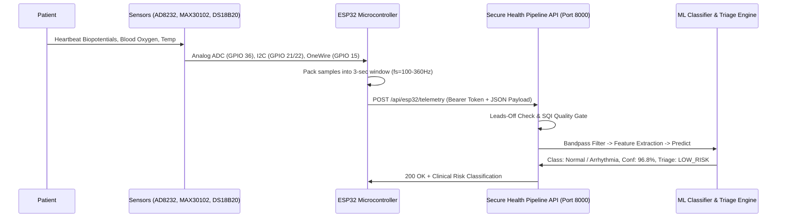

# ESP32 Patient Health Monitor: Circuit Diagram & Wiring Guide
### Sensors: AD8232 (ECG) + MAX30102 (SpO2 & Heart Rate) + DS18B20 (Temperature) + ESP32

This guide mirrors the How2Electronics IoT Patient Health Monitor architecture and integrates directly with the **Secure ML Health Pipeline** on `http://<SERVER_IP>:8000`.

---

## 1. Hardware Components Required

| Component | Description | Operating Voltage |
|---|---|---|
| **ESP32 DevKit V1** | 30 or 38 pin dual-core microcontroller with Wi-Fi & BLE | 5V (MicroUSB) / 3.3V logic |
| **AD8232 Module** | Single-lead heart rate monitor front-end (ECG analog amplifier) | 3.3V |
| **3-Lead ECG Cable & Pads** | Disposable Ag/AgCl biomedical electrode patches | Biomedical safety grade |
| **MAX30102 / MAX30100** | High-sensitivity pulse oximeter & heart rate sensor | 3.3V |
| **DS18B20 (Waterproof)** | Digital thermometer sensor (One-Wire) | 3.3V – 5.0V |
| **4.7kΩ Resistor** | Pull-up resistor for DS18B20 One-Wire data line | 1/4 Watt |
| **Breadboard & Jumper Wires**| Male-to-Male and Male-to-Female jumpers | Standard pitch (2.54mm) |

---

## 2. Complete Pinout & Wiring Connections

### A. AD8232 ECG Sensor to ESP32
The AD8232 amplifies tiny electrical biopotentials from the heart and provides an analog output along with lead-off detection pins.

```
AD8232 Pin          ESP32 Pin           Description
----------------------------------------------------------------------
3.3V        ----->  3V3                 Power supply (Do NOT use 5V!)
GND         ----->  GND                 Ground
OUTPUT      ----->  GPIO 36 (VP / ADC1) Analog ECG voltage signal (0 - 3.3V)
LO+         ----->  GPIO 2              Leads-Off Detection Right (Digital Input)
LO-         ----->  GPIO 4              Leads-Off Detection Left (Digital Input)
SDN         ----->  (Leave Unconnected) Shutdown control (active low)
```

### B. MAX30102 Pulse Oximeter & Heart Rate to ESP32 (I2C)
```
MAX30102 Pin        ESP32 Pin           Description
----------------------------------------------------------------------
VIN         ----->  3V3                 Power supply
GND         ----->  GND                 Ground
SDA         ----->  GPIO 21             I2C Serial Data
SCL         ----->  GPIO 22             I2C Serial Clock
INT         ----->  (Optional / NC)     Active-low interrupt
```

### C. DS18B20 Body Temperature Sensor to ESP32 (One-Wire)
```
DS18B20 Wire Color  ESP32 Pin           Description
----------------------------------------------------------------------
RED (VCC)   ----->  3V3                 Power supply
BLACK (GND) ----->  GND                 Ground
YELLOW (DATA)---->  GPIO 15             One-Wire digital data
* Connect 4.7kΩ resistor between YELLOW (DATA) and RED (3V3) as a pull-up!
```

---

## 3. ECG Electrode Placement on Patient Body
Standard Einthoven Triangle (Lead I / Lead II configuration):

```
       [ RA: Right Arm / Clavicle ]               [ LA: Left Arm / Clavicle ]
                (Red Wire)                                (Yellow Wire)
                     \                                         /
                      \                                       /
                       \                                     /
                        \                                   /
                         \                                 /
                                  (Green Wire)
                           [ RL: Right Leg / Lower Rib ]
                               (Ground Reference)
```
- **RA (Red)**: Right collarbone / upper right chest.
- **LA (Yellow)**: Left collarbone / upper left chest.
- **RL (Green)**: Lower right abdomen / floating ground reference to reject common-mode 50/60Hz noise.

---

## 4. Operational Flow: ESP32 to Secure ML Pipeline


